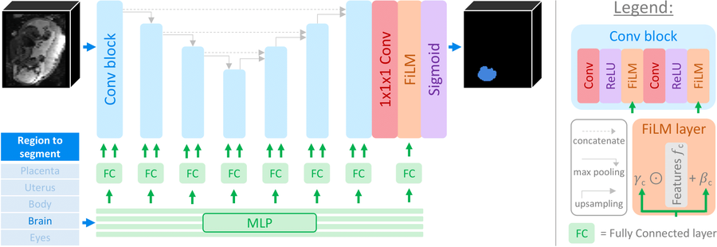
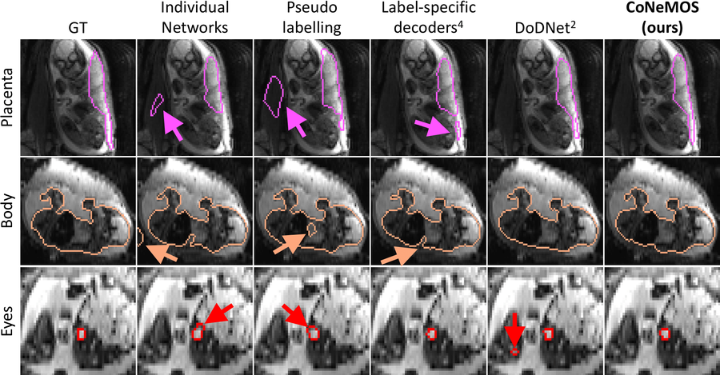

# CoNeMOS

In this repository, we present CoNeMOS (Conditional Network for Multi-Organ Segmentation), a framework to train 
segmentation model on medical images by exploiting partially annotated images (i.e., each training image can be 
annotated for a different subset of all the organs to segment). We tackle this problem by training a network to segment
one label at a time, which is done by using a conditioning method that dynamically modulates the network features based
on the label to segment. Specifically, conditioning is achieved by combining convolutions with expressive Feature-wise 
Linear Modulation (FiLM) layers1, whose parameters are controlled by an auxiliary network. This architecture enables us
to capture both label-specific (MLP) AND cross-label information (shared UNet).

 

 

In contrast to other conditioning methods (e.g., HyperNetworks), FiLM layers are more stable and faster to train. 
This enables us to condition the *entire* network, such that it can learn where to extract label-specific 
information. This is in contrast with previous partial supervision methods, that only specialise fixed part of the 
architecture like label-specific segmentation head2, last layers3 or decoders4). As a 
result our method obtains state-of-the-art results when tested on 3D segmentation of fetal data:

 

 

This repository contains all the code necessary to retrain your own model. The script that we used to train ours is 
available [here](scripts/training.py).

 

----------------

### Installation

1. Clone this repository.

2. Create a virtual environment (i.e., with pip or conda) and install all the required packages.
These depend on your python version, and we list them [here](requirements.txt) for python 3.10.

3. If you wish to run on the GPU, you will also need to install Cuda. Note that if you used conda, these should have 
already been automatically installed.

 

----------------

### Citation/Contact

This code is under [Apache 2.0](LICENSE.txt) licensing. If you find this work useful for your research, please cite:

**Network conditioning for synergistic learning on partial annotations** \
Billot, Dey, Abaci Turk, Grant, Golland \
Medical Imaging with Deep Learning (2024) \
[ [article](https://openreview.net/forum?id=sfjgmuvLS7) | [bibtex](bibtex.bib) ]

If you have any question regarding the usage of this code, or any suggestions to improve it, please raise an issue
(preferred) or contact us at:\
**bbillot@mit.edu**

 

----------------

### References

1 *FiLM: Visual Reasoning with a General Conditioning Layer* \
Perez, Strub, de Vries, Dumoulin, Courville \
AAAI Conference on Artificial Intelligence, 2018

2 *DoDNet: Learning to Segment Multi-Organ and Tumors from Multiple Partially Labeled Datasets.* \
Zhang, Xie, Xia, Shen \
CVPR, 2021

3 *MultiTalent: A Multi-dataset Approach to Medical Image Segmentation* \
Ulrich, Isensee, Wald, Zenk, Baumgartner, Maier-Hein \
MICCAI, 2023

4 *Med3D: Transfer Learning for 3D Medical Image Analysis* \
Chen, Ma, Zheng \
2019
